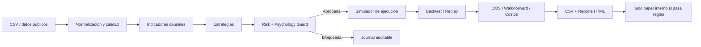

# DayTrade Lab — diseño y diagnóstico

## 1. Diagnóstico crítico

La idea es válida como laboratorio, pero el cuello de botella no es descubrir
setups: es evitar que datos imperfectos, reglas ambiguas y múltiples pruebas
fabriquen un edge inexistente. Un backtest sobre velas puede verse excelente y
seguir siendo imposible de ejecutar.

La decisión correcta para esta etapa es separar tres dominios:

1. **Investigación:** datos, señales causales, validación y comparación.
2. **Simulación:** fills conservadores, riesgo, guardas y journal.
3. **Ejecución real:** fuera de alcance y bloqueada.

El MVP sirve para descartar ideas y formular mejores experimentos. Todavía no
sirve para autorizar dinero real ni paper broker.

## 2. Riesgos principales

### Técnicos y metodológicos

- **Ambigüedad OHLC:** una vela no revela si el stop ocurrió antes que el target.
  El MVP elige `stop_first`; para estrategias sensibles se necesitan trades o
  quotes de mayor resolución.
- **Look-ahead:** indicadores y entradas deben usar solo velas cerradas. La señal
  se ejecuta desde la apertura de la vela siguiente.
- **Sesgo de supervivencia:** estudiar solo los ganadores actuales exagera
  resultados históricos. Hace falta un universo point-in-time.
- **Corporate actions:** splits, cambios de ticker y delistings deben quedar
  ajustados y auditados.
- **Calendario incompleto:** el validador del MVP conoce horario regular y fines
  de semana, pero no reemplaza un calendario oficial de feriados, early closes,
  halts o subastas.
- **Spread no observado:** OHLCV no contiene bid/ask. El spread fijo es una prueba
  de estrés, no una reconstrucción del costo real.
- **Slippage no estacionario:** crece con volatilidad, participación y eventos.
- **Shorts:** faltan disponibilidad de préstamo, hard-to-borrow, locate fees y
  restricciones particulares del broker.
- **Multiple testing:** cinco familias por activos, timeframes, horarios y
  parámetros multiplican falsos positivos.
- **Overfitting temporal:** un único split OOS no alcanza; se exige walk-forward,
  estabilidad paramétrica y repetición por regímenes.
- **Calidad del volumen:** feeds parciales pueden distorsionar RVOL, VWAP,
  rupturas y capacidad de fill.
- **Datos cripto:** cada venue tiene liquidez, velas, fees y microestructura
  diferentes. Binance no representa automáticamente otro exchange.

### Financieros y conductuales

- Drawdowns reales pueden superar los simulados.
- Costos, gaps y latencia pueden eliminar una expectativa pequeña.
- La correlación entre posiciones aumenta la exposición efectiva.
- Un resultado positivo no demuestra persistencia futura.
- FOMO, revenge trading y mover stops convierten otra estrategia en la práctica.
  Por eso el guard registra y bloquea decisiones, no solo señales.

## 3. Arquitectura



Responsabilidades:

- `src/data`: ingesta, UTC, esquema OHLCV, gaps y persistencia.
- `src/indicators`: EMA, ATR, RSI, RVOL y VWAP por sesión.
- `src/strategies`: señales y niveles; no sizing ni fills.
- `src/execution_simulator`: órdenes y costos simulados.
- `src/risk`: sizing y límites financieros.
- `src/psychology_guard`: bloqueos conductuales.
- `src/backtesting`: orquestación, métricas y robustez.
- `src/scanner`: ranking de candidatos, nunca órdenes.
- `src/replay`: avance vela a vela sin mirar el futuro.
- `src/journal` y `src/reports`: trazabilidad y artefactos.

## 4. Estrategias iniciales

### Opening Range Breakout

Rango inicial configurable de 15/30/60 minutos, ruptura con RVOL, filtro de
tamaño del rango relativo a ATR, stop dentro del rango y target por R.

Riesgo dominante: falsos breakouts y selección del rango después de observar el
resultado. La duración debe fijarse antes del test.

### VWAP Pullback

Tendencia por EMAs, toque/rechazo de VWAP y salida estructural. Es sensible a la
definición de sesión y a si VWAP usa un feed de volumen completo.

### Relative Volume Momentum

Ruptura de máximos/mínimos previos con RVOL alto y límite de extensión en ATR.
El filtro FOMO bloquea señales cercanas al máximo de extensión.

### Extreme Mean Reversion

Extensión contra VWAP, RSI extremo y vela de reversión. Exige confirmación extra
contra tendencias fuertes. Es la familia con mayor riesgo de “atrapar un
cuchillo”.

### Trend Day Continuation

Precio del lado correcto de VWAP, EMAs alineadas y pullback ordenado. Puede
sufrir en días laterales y depende de una definición causal de “trend day”.

Los parámetros incluidos son hipótesis iniciales, no valores optimizados.

## 5. Fuentes de datos recomendadas

Evaluación revisada en julio de 2026:

| Fuente | Uso recomendado | Evaluación |
|---|---|---|
| Binance Spot public market data | BTCUSDT, ETHUSDT, SOLUSDT | Primera opción para investigación del propio venue. Los endpoints públicos no requieren credenciales. El MVP implementa solo klines públicas. |
| Massive (antes Polygon.io) | Acciones/ETF de EE. UU. | Primera opción si el presupuesto permite datos SIP, agregados de minuto y luego trades/quotes. Es la vía más útil para mejorar spread y orden intrabar. |
| Alpaca Market Data | Acciones y futura validación paper | Útil, pero el feed gratuito IEX es parcial; para RVOL/VWAP serio conviene SIP. Paper trading sigue siendo una simulación y omite impacto, queue position y slippage por latencia. No está conectado en este MVP. |
| Twelve Data | Prototipo multiactivo / respaldo | API uniforme y timeframes requeridos. Verificar historial, créditos, feed exacto, ajustes y licencia antes de usar resultados para aprobar una estrategia. |
| Yahoo mediante yfinance | Exploración rápida, no fuente maestra | Intradía limitado a los últimos 60 días según su documentación. Insuficiente como dataset principal para OOS y walk-forward robustos. |
| CSV manual validado | Auditoría y proveedores no integrados | Totalmente soportado. Debe conservar fuente, timezone, ajustes, sesión y fecha de descarga en metadatos externos. |

Referencias oficiales:

- Binance: <https://developers.binance.com/en/docs/products/spot/rest-api>
- Massive minute aggregates: <https://massive.com/docs/flat-files/stocks/minute-aggregates>
- Massive custom bars: <https://massive.com/docs/rest/stocks/aggregates/custom-bars>
- Alpaca historical data: <https://docs.alpaca.markets/us/docs/historical-api>
- Alpaca stock feeds: <https://docs.alpaca.markets/us/docs/historical-stock-data-1>
- Alpaca paper limitations: <https://docs.alpaca.markets/us/docs/paper-trading>
- Twelve Data time series: <https://twelvedata.com/docs>
- yfinance download: <https://ranaroussi.github.io/yfinance/reference/api/yfinance.download.html>

Balanz, Lemon, IOL y PPI quedan fuera hasta verificar formalmente API,
instrumentos, liquidez, spreads, costos, shorting, rate limits y términos.

## 6. Modelo de ejecución del MVP

- La señal nace al cierre de una vela.
- Una market order intenta llenar desde la apertura siguiente más la latencia.
- Spread y slippage se aplican de manera adversa.
- El volumen limita la cantidad según `max_volume_participation`.
- Las limit expiran; pueden no llenar o llenar parcialmente.
- Si stop y target aparecen en la misma vela, gana el stop.
- En la vela de entrada limit se ignora un target-only touch, porque pudo ocurrir
  antes del fill.
- Partial exit mueve el stop restante a breakeven.
- Trailing stops se actualizan para la vela siguiente.
- Toda posición restante sale al final del dataset.

Esto es deliberadamente conservador, pero no sustituye bid/ask, order book,
trades ni modelado de cola.

## 7. Riesgo y Psychology Guard

El sizing usa:

```text
cantidad = min(
    riesgo monetario / distancia al stop,
    máximo notional / precio,
    máxima exposición / precio
)
```

Antes de ejecutar se controlan stop obligatorio, R/R, spread, RVOL, ATR,
exposición, tamaño, pérdida diaria/semanal, trades diarios y kill switch.

El guard controla setup permitido, ventana horaria, cooldown tras pérdida,
frecuencia por hora, FOMO, alejamiento manual del stop y aumento de tamaño
después de perder. Tres pérdidas consecutivas bloquean la sesión y se reinician
al día siguiente; los límites diario y semanal no se reinician de esa forma.

## 8. Protocolo de investigación

1. Congelar hipótesis, reglas y parámetros antes de medir.
2. Obtener datos con suficiente historial y documentar el feed.
3. Ejecutar tests de calidad y excluir velas incompletas.
4. Separar cronológicamente 70% in-sample y 30% out-of-sample.
5. No ajustar parámetros mirando el OOS.
6. Ejecutar walk-forward anclado.
7. Duplicar costos y observar si el resultado sobrevive.
8. Comparar activos, horarios, timeframes y regímenes.
9. Revisar concentración por activo, día y hora.
10. Registrar todos los intentos, incluidos no-fills y bloqueos.

El walk-forward actual no optimiza: conserva parámetros fijos y evalúa ventanas
sucesivas. Es preferible a una búsqueda agresiva en este MVP.

## 9. Regla de aprobación

`approval_decision` rechaza paper interno si:

- retorno OOS no es positivo;
- profit factor no supera 1,25;
- hay menos de 100 trades OOS;
- drawdown supera el techo conservador del 20%;
- más del 70% del PnL positivo depende de un activo/setup/hora;
- más del 35% depende de un día;
- los costos consumen más del 50% de la ganancia bruta.

Además de esas reglas automáticas, la aprobación manual exige sentido económico,
estabilidad en parámetros, tolerancia a costos altos y una proporción razonable
de señales aprobadas por el guard.

Aunque pase, el único destino permitido es **paper interno**. Paper broker y live
trading siguen prohibidos.

## 10. Plan de implementación

### Entrega actual — MVP

- Arquitectura modular, cinco estrategias y datos sintéticos reproducibles.
- Ingesta CSV y Binance pública.
- Simulación, riesgo, Psychology Guard, scanner, replay, journal y reportes.
- OOS, walk-forward, sensibilidad de costos y tests.

### Siguiente fase — calidad de evidencia

- Calendario oficial de mercado y metadata point-in-time.
- Adaptadores read-only para Massive/Alpaca/Twelve Data.
- Quotes NBBO para spread histórico y trades para secuencia intrabar.
- Corporate actions, delistings, halts y short availability.
- Tests por activo y varios años/regímenes.

### Fase posterior — práctica controlada

- UI local de replay y checklist pre-trade.
- Alertas sin órdenes.
- Registro manual de emociones, screenshots y cumplimiento.
- Paper interno prolongado con parámetros congelados.

No se propone integración con broker en estas fases.

## 11. Estructura

```text
DayTrade Lab/
├── config.yaml
├── .env.example
├── requirements.txt
├── README.md
├── src/
│   ├── data/
│   ├── indicators/
│   ├── strategies/
│   ├── execution_simulator/
│   ├── risk/
│   ├── psychology_guard/
│   ├── backtesting/
│   ├── replay/
│   ├── scanner/
│   ├── journal/
│   ├── reports/
│   ├── config/
│   └── utils/
├── tests/
├── notebooks/
├── outputs/daytrade/
├── logs/
├── data/
└── docs/DAYTRADE_LAB.md
```

## 12. Limitaciones conocidas

- Motor por barras, no event-driven por tick.
- Un símbolo por corrida CLI; la comparación multi-activo se arma concatenando
  corridas reproducibles.
- No hay optimizador de parámetros, a propósito.
- No hay calendario de feriados ni early closes.
- RVOL usa baseline rolling, no perfil histórico por minuto de sesión.
- VWAP cripto usa actualmente corte diario de la timezone del laboratorio.
- No se modelan borrow fees, market impact ni queue position.
- El scanner necesita que el usuario provea un spread observado si quiere un
  filtro real; el default es solo escenario.
- No hay UI gráfica; el replay queda exportado a CSV.

Estas limitaciones impiden interpretar el MVP como prueba suficiente de edge.
